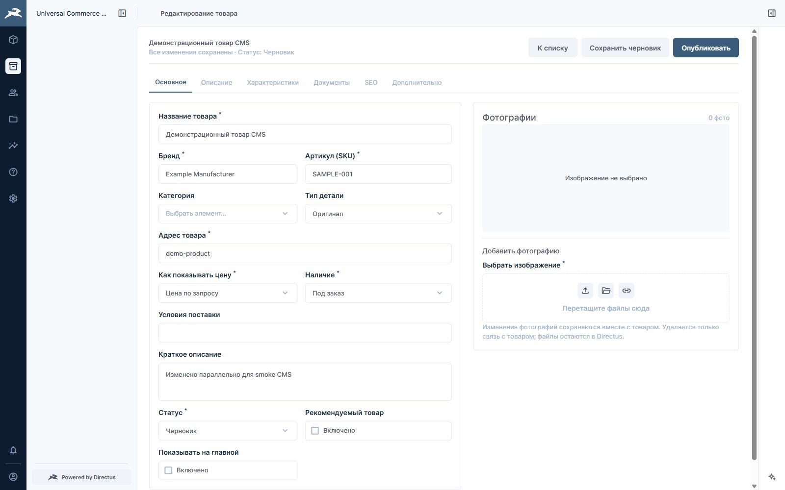
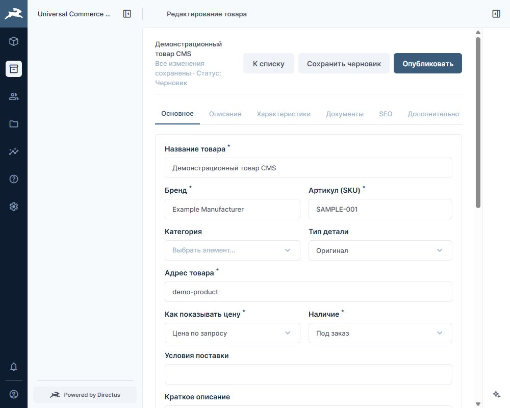
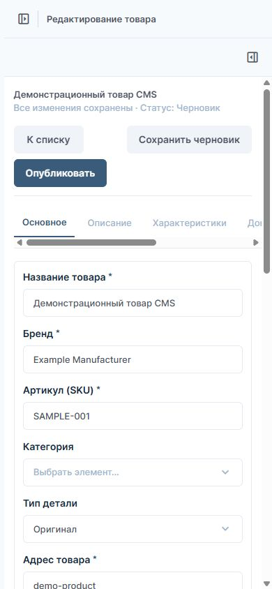

# Local acceptance — 2026-10-02

Scope: the standalone baseline approved for `D:\codex\Universal Commerce CMS` and `alexdubaev/Universal-Commerce-CMS`. This is local development acceptance, not a production deployment or completion of all custom section editors.

## Deterministic evidence

- `node --test` from `directus/`: 166 passed, 0 failed, 0 skipped; Node 24.15.0.
- `node docs/admin-sections/research/verify-package.mjs`: passed; 14 section packages, 335 section fields, 9 support collections, 432 schema fields, 57 mockup tabs, 43 JSON and 78 Markdown files. This verifies offline source/data, not browser rendering of the mockups.
- Compose config validation passed without printing resolved credentials.
- Schema/bootstrap completed successfully. A repeated bootstrap preserved the edited neutral seed product.

## New instance

Directus 12.1.1 and PostgreSQL 17 run in `universal-commerce-cms-dev`, with their own database/uploads volumes and loopback-only `127.0.0.1:18056` HTTP port. The installed server reported seven loaded packages, including Flexible Editor and Directus Labs SEO plugin, and reported that it watches extensions for changes.

Authenticated `/server/health` returned `ok`. The API contains 23 business/support collections. The synthetic demo product remains a draft. The only installed role is Administrator; anonymous product reads return 403. Generated credentials and instance IDs remain in ignored `dev/.env` and are excluded from Git.

Initial setup exposed an invalid demonstration admin email and a Directus Core permission restriction; the email generator was corrected to `admin@example.com`. The failed setup's unassigned partial API role/policy was inspected and removed only from this new instance. Default bootstrap now creates asset folders and uses Administrator. Strict business-policy setup remains explicit opt-in for an entitled instance. No permission filters were removed to bypass the edition restriction.

The final business access blueprint is statically regression-tested but was not installed in this Core instance. The installed Directus 12.1.1 Files controller attempts `FilesService.readOne` after multipart upload and suppresses the response payload when that read is forbidden. To preserve upload response metadata, the opt-in frontend policy allows reads from Public and from private files uploaded by that same account only; blueprint filter regression tests verify denial of other accounts' private files. The installed Directus utils resolve bare `$CURRENT_USER` to the accountable user ID. No non-admin role behavior is claimed as runtime-verified.

## Browser evidence

- Administrator login succeeded at the new local address. The project title is Universal Commerce CMS and the product editor appears in native module navigation.
- The synthetic draft loaded with six editor tabs. A title edit was saved as a draft and survived reload.
- Native media selection opened the Directus file library, showing the new Public folder and no existing files; cancellation succeeded. Actual file upload was not exercised.
- A concurrent API edit produced the editor's conflict alert. The typed local title was retained and did not overwrite the saved database title.
- The final CSS bundle was loaded after a restart of only the new Directus container. Its container type was measured as `inline-size`.
- At a 1000px viewport the editor shell was 650px wide and the grid had one 602px column, avoiding the previously observed overlapping fields. At 1600px the 1250px shell used two columns. At 390px the document width remained 390px with a single form column. Temporary viewport overrides were reset.

The in-app browser's dirty-navigation confirmation timed out during the conflict scenario. After restart, further click-driven scenarios could not be confirmed reliably through that browser session; direct navigation and DOM/screenshot measurements worked. New-record creation, actual upload and the dirty-navigation dialog are therefore not claimed as browser-verified. Relevant create/default, save-lock, failed-save and route-state contracts are covered by the deterministic suite. The third-party packages loaded; complete interface/edition compatibility is not inferred from that alone.

## Boundaries and next work

The source checkout retained its original tracked state and pre-existing untracked artifacts. Deereshop's frontend, containers, data, credentials and production configuration were not changed. No source catalogue, media, leads/orders or environment files were imported.

The product editor is implemented. The other sections retain native Directus forms; their separate specifications, field maps, launch briefs and shared design references are in [TASK-INDEX](../admin-sections/TASK-INDEX.md). A0 shared prerequisites come before parallel custom-section implementation. G1/G2 limitations remain explicit in those materials.

Independent review and the reviewed initial commit/publication are recorded in the implementation plan and Git history when completed.

Final review gate: three independent review passes covered the initial extraction and its bounded corrections. The final fresh review reported no P0/P1/P2 findings and reran the passing tests/material verifier. The lead personally verified the final 166-test suite, staged corrections, isolation evidence and excluded local secrets before the initial publication.
